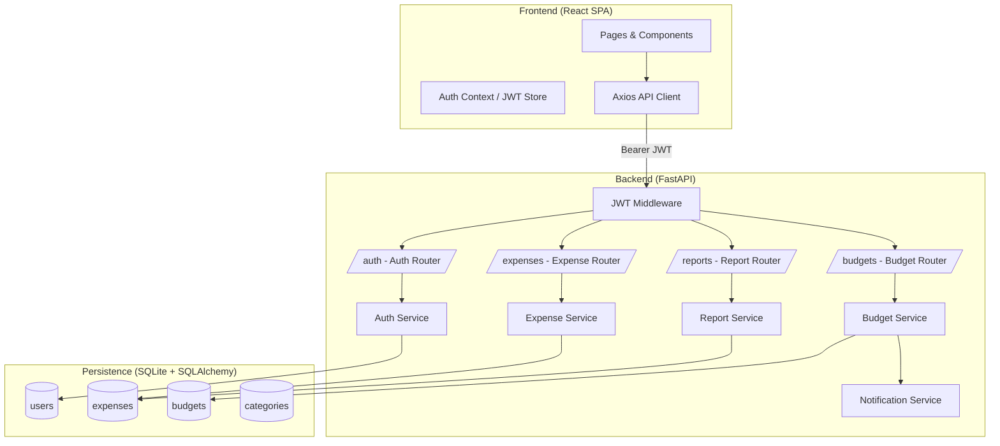

# Design Document

## Overview

The Daily Expense Manager is a full-stack web application for personal expense tracking. Users register and authenticate via JWT, then perform CRUD operations on expense records, view visual dashboards, generate monthly reports, and export data. The system is composed of a React SPA frontend, a FastAPI Python backend, and a SQLite database.

The architecture follows a clean separation between the presentation layer (React), the API layer (FastAPI), and the persistence layer (SQLite via SQLAlchemy). JWT-based authentication secures all expense-related endpoints. Optional features (budget alerts, reminders) are designed as pluggable services that can be enabled independently.

---

## Architecture



**Key design decisions:**

- Single-page application with React Router for client-side navigation — avoids full-page reloads and keeps the JWT in memory/localStorage.
- FastAPI chosen for automatic OpenAPI docs, Pydantic validation, and async support.
- SQLite is sufficient for a single-user or small-team deployment; SQLAlchemy ORM abstracts the database so migration to PostgreSQL is straightforward.
- JWT access tokens (60 min) + refresh tokens (7 days) stored in `budgets` table for invalidation on logout.
- All API responses use a consistent JSON envelope for errors.

---

## Components and Interfaces

### Frontend Components

| Component | Responsibility |
|---|---|
| `AuthPage` | Registration and login forms |
| `DashboardPage` | Summary cards, bar chart (30-day), pie chart (monthly category) |
| `ExpenseListPage` | Paginated expense table with filter/search controls |
| `ExpenseFormModal` | Create / edit expense form with inline validation |
| `ReportPage` | Monthly report view with export buttons |
| `BudgetPage` | Set per-category budget limits, view progress bars |
| `NavBar` | Responsive navigation, collapses to hamburger below 768px |
| `AuthContext` | React context providing `user`, `token`, `login()`, `logout()` |
| `apiClient` | Axios instance with base URL and `Authorization` header interceptor |

### Backend Routers and Endpoints

#### Auth (`/auth`)

| Method | Path | Description |
|---|---|---|
| POST | `/auth/register` | Register new user |
| POST | `/auth/login` | Login, returns access + refresh tokens |
| POST | `/auth/refresh` | Exchange refresh token for new access token |
| POST | `/auth/logout` | Invalidate refresh token |

#### Expenses (`/expenses`)

| Method | Path | Description |
|---|---|---|
| GET | `/expenses` | List expenses (supports `start_date`, `end_date`, `keyword`, `category` query params) |
| POST | `/expenses` | Create expense |
| PUT | `/expenses/{id}` | Update expense |
| DELETE | `/expenses/{id}` | Delete expense |

#### Reports (`/reports`)

| Method | Path | Description |
|---|---|---|
| GET | `/reports/monthly` | Monthly summary (`year`, `month` query params) |
| GET | `/reports/export` | Export data (`format=csv|pdf`, optional `start_date`, `end_date`) |

#### Budgets (`/budgets`)

| Method | Path | Description |
|---|---|---|
| GET | `/budgets` | List all budgets for current user |
| POST | `/budgets` | Set or update budget for a category |

---

## Data Models

### Pydantic Schemas (API layer)

```python
class UserCreate(BaseModel):
    email: EmailStr
    password: str  # min length 8 enforced
    display_name: str

class UserOut(BaseModel):
    id: int
    email: EmailStr
    display_name: str
    created_at: datetime

class TokenResponse(BaseModel):
    access_token: str
    refresh_token: str
    token_type: str = "bearer"

class ExpenseCreate(BaseModel):
    amount: float          # must be > 0
    category: CategoryEnum # Food | Travel | Shopping | Bills | Others
    date: date             # ISO 8601
    description: Optional[str] = None  # max 255 chars

class ExpenseOut(ExpenseCreate):
    id: int
    user_id: int
    created_at: datetime
    updated_at: datetime

class ExpenseUpdate(BaseModel):
    amount: Optional[float] = None
    category: Optional[CategoryEnum] = None
    date: Optional[date] = None
    description: Optional[str] = None

class MonthlyReportOut(BaseModel):
    year: int
    month: int
    total_amount: float
    expense_count: int
    category_breakdown: list[CategorySummary]

class CategorySummary(BaseModel):
    category: CategoryEnum
    total: float
    percentage: float

class BudgetSet(BaseModel):
    category: CategoryEnum
    monthly_limit: float  # must be > 0

class BudgetOut(BudgetSet):
    id: int
    user_id: int
    current_spending: float
    updated_at: datetime

class ErrorResponse(BaseModel):
    status_code: int
    detail: str
```

### SQLAlchemy ORM Models (DB layer)

```python
class User(Base):
    __tablename__ = "users"
    id: int (PK)
    email: str (unique, indexed)
    display_name: str
    password_hash: str
    created_at: datetime

class Expense(Base):
    __tablename__ = "expenses"
    id: int (PK)
    user_id: int (FK → users.id, CASCADE DELETE)
    category: str
    amount: float
    date: date (indexed)
    description: Optional[str]
    created_at: datetime
    updated_at: datetime

class Budget(Base):
    __tablename__ = "budgets"
    id: int (PK)
    user_id: int (FK → users.id, CASCADE DELETE)
    category: str
    monthly_limit: float
    created_at: datetime
    updated_at: datetime
    # UNIQUE constraint on (user_id, category)

class Category(Base):
    __tablename__ = "categories"
    id: int (PK)
    name: str (unique)  # seeded: Food, Travel, Shopping, Bills, Others
```

### CategoryEnum

```python
from enum import Enum

class CategoryEnum(str, Enum):
    FOOD = "Food"
    TRAVEL = "Travel"
    SHOPPING = "Shopping"
    BILLS = "Bills"
    OTHERS = "Others"
```

### Refresh Token Storage

Refresh tokens are stored as a hashed value in a `refresh_tokens` table:

```python
class RefreshToken(Base):
    __tablename__ = "refresh_tokens"
    id: int (PK)
    user_id: int (FK → users.id, CASCADE DELETE)
    token_hash: str (indexed)
    expires_at: datetime
    revoked: bool = False
```

---

## Correctness Properties

*A property is a characteristic or behavior that should hold true across all valid executions of a system — essentially, a formal statement about what the system should do. Properties serve as the bridge between human-readable specifications and machine-verifiable correctness guarantees.*

### Property 1: Valid registration creates a user

*For any* unique email, password of at least 8 characters, and display name, submitting a registration request SHALL result in a 201 response and a retrievable user record with the provided email and display name.

**Validates: Requirements 1.1**

---

### Property 2: Duplicate email registration is rejected

*For any* email that has already been registered, submitting a second registration request with that same email SHALL return a 409 response.

**Validates: Requirements 1.2**

---

### Property 3: Short password registration is rejected

*For any* password string of length 0 through 7 (inclusive), submitting a registration request SHALL return a 422 response.

**Validates: Requirements 1.3**

---

### Property 4: Passwords are stored as bcrypt hashes

*For any* registered user, the value stored in the `password_hash` column SHALL NOT equal the plaintext password and SHALL be a valid bcrypt hash (prefixed with `$2b$`).

**Validates: Requirements 1.4**

---

### Property 5: Invalid credentials are rejected with 401

*For any* login request submitted with either an incorrect password for an existing email, or an email that does not exist in the system, the Auth_Service SHALL return a 401 response.

**Validates: Requirements 2.2, 2.3**

---

### Property 6: JWT access token has correct expiry

*For any* successful login, the returned access token SHALL decode to a JWT with an `exp` claim approximately 60 minutes in the future, and the refresh token SHALL have an expiry approximately 7 days in the future.

**Validates: Requirements 2.1**

---

### Property 7: Invalid or expired JWT is rejected

*For any* request to a protected endpoint carrying a token that is not a valid signed JWT (including expired tokens, random strings, or tampered tokens), the system SHALL return a 401 response.

**Validates: Requirements 2.4**

---

### Property 8: Logout invalidates the refresh token

*For any* authenticated session, after a logout request is processed, attempting to use the associated refresh token to obtain a new access token SHALL return a 401 response.

**Validates: Requirements 2.5**

---

### Property 9: Valid expense creation round-trip

*For any* authenticated request containing a positive amount, a valid category, an ISO 8601 date, and an optional description of at most 255 characters, the Expense_Service SHALL return a 201 response and the created record SHALL be retrievable with all fields matching the submitted values.

**Validates: Requirements 3.1**

---

### Property 10: Invalid expense fields are rejected with 422

*For any* create or update expense request containing at least one invalid field — a non-positive amount, a category string not in {Food, Travel, Shopping, Bills, Others}, or a date string not in ISO 8601 format — the Expense_Service SHALL return a 422 response.

**Validates: Requirements 3.2, 3.3, 3.4, 4.4**

---

### Property 11: Cross-user expense access is forbidden

*For any* two distinct authenticated users A and B, and any expense owned by user A, an update or delete request for that expense submitted by user B SHALL return a 403 response.

**Validates: Requirements 4.2, 5.2**

---

### Property 12: Non-existent expense returns 404

*For any* expense ID that does not exist in the database, an update or delete request for that ID SHALL return a 404 response.

**Validates: Requirements 4.3, 5.3**

---

### Property 13: Expense deletion removes the record

*For any* expense owned by the authenticated user, after a successful delete request (204 response), a subsequent GET request for that expense ID SHALL return a 404 response.

**Validates: Requirements 5.1**

---

### Property 14: Expense aggregation correctness

*For any* set of expense records belonging to a user, the computed totals for the current day, current week (Monday–Sunday), and current month SHALL each equal the arithmetic sum of the `amount` fields of all expenses whose `date` falls within the respective period.

**Validates: Requirements 6.1**

---

### Property 15: Category breakdown sums to total

*For any* set of expense records for a given month, the category-wise breakdown SHALL include every category that has at least one expense, the `total` for each category SHALL equal the sum of amounts for that category, the `percentage` for each category SHALL equal `(category_total / month_total) * 100`, and the sum of all category percentages SHALL equal 100 (within floating-point tolerance).

**Validates: Requirements 6.2**

---

### Property 16: 30-day daily totals aggregation

*For any* set of expense records, the daily aggregation function SHALL produce exactly 30 data points (one per calendar day for the last 30 days), and each data point's value SHALL equal the sum of amounts for expenses on that day (zero for days with no expenses).

**Validates: Requirements 7.1**

---

### Property 17: Date range filter returns only in-range expenses, ordered descending

*For any* authenticated user, any set of expense records, and any valid date range [start, end] where start ≤ end, the list-expenses endpoint SHALL return only expenses whose `date` falls within the inclusive range [start, end], and the results SHALL be ordered by `date` descending. When no date filters are provided, all expenses for the user SHALL be returned ordered by `date` descending.

**Validates: Requirements 8.1, 8.3**

---

### Property 18: Invalid date range is rejected

*For any* list-expenses request where the `start_date` is strictly after the `end_date`, the Expense_Service SHALL return a 422 response.

**Validates: Requirements 8.2**

---

### Property 19: Search filters return only matching expenses

*For any* authenticated user, any set of expense records, and any combination of keyword and/or category filters, the list-expenses endpoint SHALL return only expenses that satisfy ALL provided filters simultaneously — keyword match is case-insensitive substring match on `description`, and category match is exact equality.

**Validates: Requirements 9.1, 9.2, 9.3**

---

### Property 20: Monthly report totals are correct

*For any* authenticated user and any valid (year, month) pair, the monthly report SHALL return a `total_amount` equal to the sum of all expense amounts for that user in that month, an `expense_count` equal to the number of such expenses, and a `category_breakdown` whose category totals sum to `total_amount`.

**Validates: Requirements 10.1**

---

### Property 21: Invalid month/year is rejected

*For any* monthly-report request with a month value outside [1, 12] or a year value that is not a valid calendar year (e.g., negative), the Report_Service SHALL return a 422 response.

**Validates: Requirements 10.3**

---

### Property 22: CSV export round-trip

*For any* authenticated user and any set of matching expenses, the CSV export SHALL contain exactly one row per expense, and each row SHALL include the correct values for `date`, `category`, `amount`, and `description` matching the stored records.

**Validates: Requirements 11.1**

---

### Property 23: Invalid export format is rejected

*For any* export request with a `format` parameter value that is not `csv` or `pdf`, the Report_Service SHALL return a 422 response.

**Validates: Requirements 11.3**

---

### Property 24: Budget threshold alerts are generated correctly

*For any* user with a budget set for a category, after adding expenses such that the total for that category in the current month reaches or exceeds 80% of the budget limit, the Budget_Service threshold evaluator SHALL indicate that an alert should be generated; and when the total reaches or exceeds 100%, it SHALL indicate that an over-budget alert should be generated.

**Validates: Requirements 13.2, 13.3**

---

### Property 25: Error responses conform to the standard schema

*For any* request that results in a 4xx or 5xx response, the response body SHALL be a JSON object containing at minimum an integer field `status_code` and a string field `detail`.

**Validates: Requirements 16.2**

---

## Error Handling

### Backend Error Strategy

All FastAPI exception handlers return a consistent JSON envelope:

```json
{
  "status_code": 422,
  "detail": "amount must be greater than 0"
}
```

| Scenario | HTTP Status | Notes |
|---|---|---|
| Validation failure (Pydantic) | 422 | FastAPI default, overridden to match schema |
| Duplicate email on register | 409 | Custom exception handler |
| Invalid/expired JWT | 401 | JWT middleware |
| Wrong credentials | 401 | Auth service |
| Resource not found | 404 | Service layer raises `HTTPException(404)` |
| Cross-user access | 403 | Service layer ownership check |
| Invalid export format | 422 | Pydantic enum validation |
| Unhandled exception | 500 | Global exception handler logs full traceback |
| Route not found | 404 | FastAPI default 404 handler overridden to match schema |

**Global exception handler** (catches all unhandled exceptions):

```python
@app.exception_handler(Exception)
async def global_exception_handler(request, exc):
    logger.exception("Unhandled exception", exc_info=exc)
    return JSONResponse(
        status_code=500,
        content={"status_code": 500, "detail": "Internal server error"}
    )
```

### Frontend Error Handling

- Axios response interceptor catches 401 responses and triggers automatic token refresh (one retry). If refresh fails, the user is logged out.
- Form validation errors (422) are parsed and displayed inline adjacent to the relevant field.
- Network errors display a toast notification.
- 403/404 errors redirect to an appropriate error page.

---

## Testing Strategy

### Overview

The testing strategy uses a dual approach: property-based tests for universal correctness properties and unit/integration tests for specific examples, edge cases, and infrastructure concerns.

### Property-Based Testing

**Library**: [Hypothesis](https://hypothesis.readthedocs.io/) (Python) for backend properties.

**Configuration**: Each property test runs a minimum of 100 iterations (`@settings(max_examples=100)`).

**Tag format**: Each property test is tagged with a comment:
```python
# Feature: daily-expense-manager, Property N: <property_text>
```

**Scope**: Properties 1–25 defined in the Correctness Properties section above. Each property maps to a single Hypothesis test.

**Example**:

```python
from hypothesis import given, settings, strategies as st

# Feature: daily-expense-manager, Property 3: Short password registration is rejected
@given(password=st.text(max_size=7))
@settings(max_examples=100)
def test_short_password_rejected(client, password):
    response = client.post("/auth/register", json={
        "email": "test@example.com",
        "password": password,
        "display_name": "Test"
    })
    assert response.status_code == 422
```

### Unit Tests

Unit tests cover:
- Specific examples for happy-path flows (register, login, CRUD)
- Edge cases not covered by property generators (empty description, boundary dates)
- Service-layer logic in isolation (mocked DB)
- JWT encoding/decoding utilities
- CSV generation function with known inputs
- Budget threshold evaluation with exact boundary values (79.9%, 80.0%, 100.0%, 100.1%)

### Integration Tests

Integration tests cover:
- Full request/response cycle for each endpoint using a test SQLite database
- PDF export endpoint (1-2 examples verifying `Content-Type: application/pdf` and non-empty body)
- Dashboard data endpoint with budgets set (verifying spending + limit in response)
- Database schema integrity (foreign key cascade, unique constraints)
- Refresh token flow end-to-end

### Smoke Tests

Smoke tests (single execution, schema inspection) cover:
- Database schema: verify all tables exist with correct columns, indexes, and constraints (Requirements 17.1–17.6)
- Responsive layout: manual testing at 320px, 768px, 1280px
- Hamburger menu: manual testing below 768px
- Inline validation feedback timing: manual testing

### Frontend Testing

- **React Testing Library** for component unit tests
- Snapshot tests for chart components (bar chart, pie chart)
- Example-based tests for form validation feedback (inline error display)
- Mock API responses using `msw` (Mock Service Worker)

### Test Organization

```
backend/
  tests/
    test_auth_properties.py       # Properties 1–8
    test_expense_properties.py    # Properties 9–13
    test_dashboard_properties.py  # Properties 14–16
    test_filter_properties.py     # Properties 17–19
    test_report_properties.py     # Properties 20–23
    test_budget_properties.py     # Property 24
    test_error_properties.py      # Property 25
    test_integration.py           # Integration tests
    test_smoke.py                 # Schema smoke tests

frontend/
  src/
    __tests__/
      components/                 # React component tests
      pages/                      # Page-level tests
```
